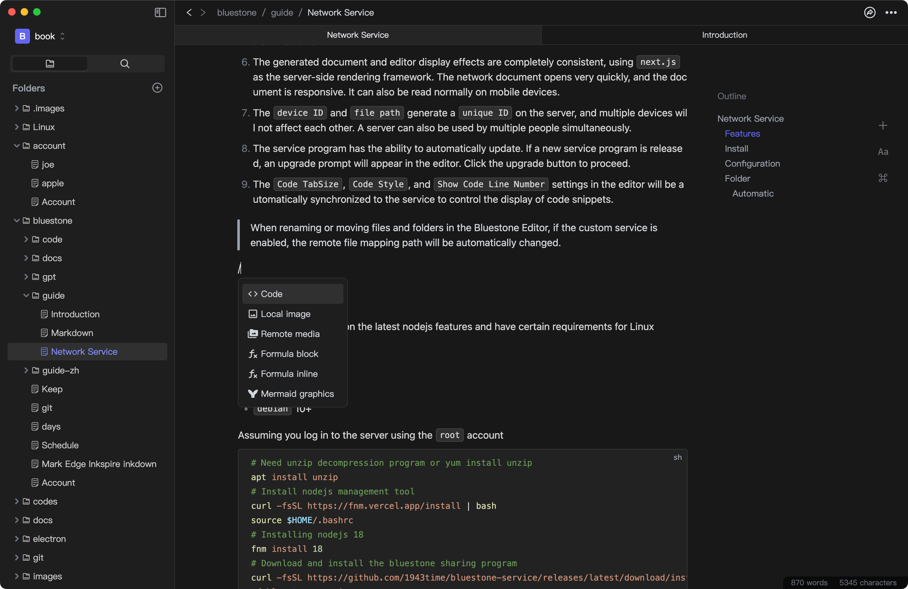
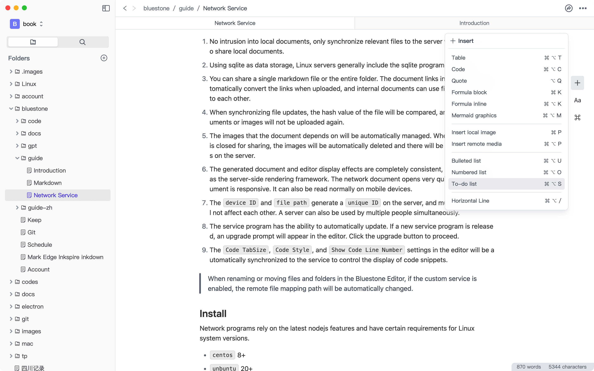

<h1> Bluestone Markdown</h1>
Improve markdown reading and editing experience, and facilitate network sharing.

[Documentation](https://doc.bluemd.me/doc/tAfxJPwODVe4i) | [中文文档](https://doc.bluemd.me/doc/Q1vCjNmL8Dnvz)

|                                                                                                                                                               |                                                                                                                                                           |                                                                                                                                                                                                                                                                                                                                                                                                                                      |  |
| :-------------------------------------------------------------------------------------------------------------------------------------------------------------------------------------------------------: | :------------------------------------------------------------------------------------------------------------------------------------------------------------------------------------------------------: | :-------------------------------------------------------------------------------------------------------------------------------------------------------------------------------------------------------------------------------------------------------------------------------------------------------------------------------------------------------------------------------------------------------------------------------------------------------------------------------: | ---------------------------------------------- |
| [mac-arm64](https://github.com/1943time/bluestone/releases/latest/download/Bluestone-mac-arm64.dmg)   [mac-x64](https://github.com/1943time/bluestone/releases/latest/download/Bluestone-mac-x64.dmg) | [win-arm64](https://github.com/1943time/bluestone/releases/latest/download/Bluestone-win-arm64.exe)  [win-x64](https://github.com/1943time/bluestone/releases/latest/download/Bluestone-win-x64.exe) | [linux-amd64.deb](https://github.com/1943time/bluestone/releases/latest/download/Bluestone-linux-amd64.deb) \| [linux-x86_64.AppImage](https://github.com/1943time/bluestone/releases/latest/download/Bluestone-linux-x86_64.AppImage)   [linux-arm64.AppImage](https://github.com/1943time/bluestone/releases/latest/download/Bluestone-linux-arm64.AppImage) \| [linux-arm64.deb](https://github.com/1943time/bluestone/releases/latest/download/Bluestone-linux-arm64.deb) | [Preview online](https://editor.bluemd.me) |

OR 

> The release time of mac store will be delayed by 1-3 days
>
> 由于工信部要求APP备案原因，中国内地地区暂未上架Mac Store。

---

# Introduction

Bluestone is an WYSIWYG Markdown editor，use [GFM](https://github.github.com/gfm/) syntax，expanded [Mermaid](https://mermaid.js.org/) graphics [Katex](https://katex.org/) formula，
Supports light and dark color theme. and generate your Markdown files into online documents in the easiest and fastest way.

As a document publisher, markdown source code mode is undoubtedly efficient and free,
but as a note, it is not conducive to reading.
The table element of markdown is not conducive to writing,
and the double-column mode is not conducive to focusing,
so the Bluestone Editor was developed. It combines rich text with markdown editing habits to help you record daily,
and saves it in standard markdown format, which allows your notes to be used anywhere and backed up in any way.

## Features

- The rich text editing mode is used, while also compatible with Markdown syntax conversion and editing habits. When using the search function, Markdown symbols will not be searched.
- Automatically record and clear file history, can be viewed and rolled back at any time.
- Using [shiki](https://github.com/shikijs/shiki) as a code shader to make code highlights more fine-grained and aesthetically pleasing.
- Provides a powerful sharing program, Linux server required [doc](https://doc.bluemd.me/doc/tAfxJPwODVe4i#sharing-service).
- Enhanced table operations, allowing for easy adjustment of the order and quantity of rows and columns in the table, and the ability to wrap within the table.
- Support the editing and display of block and inline [Katex](https://katex.org/) formulas
- Supports [mermaid](https://mermaid.js.org/) graphic syntax.
- The file path link can be automatically reconstructed, and when a file or folder is renamed or moved, the local path of the links or images that the document depends on will be automatically changed.
- You can freely drag and adjust the order of document elements.
- Supports multi tab editing mode
- Support pasting HTML, plain text, and markdown code. When pasting HTML and markdown code, it can be configured to automatically download network images to the local machine and convert paths during pasting.
