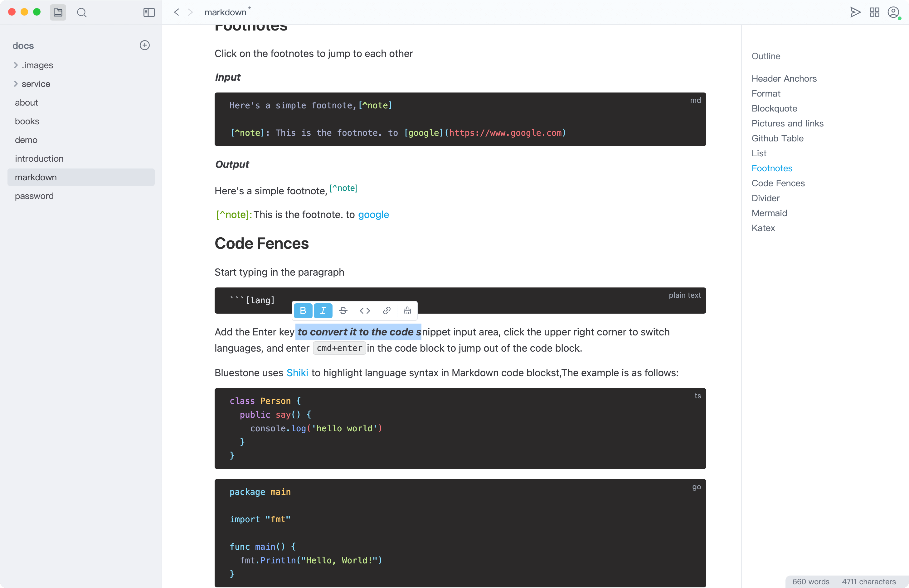
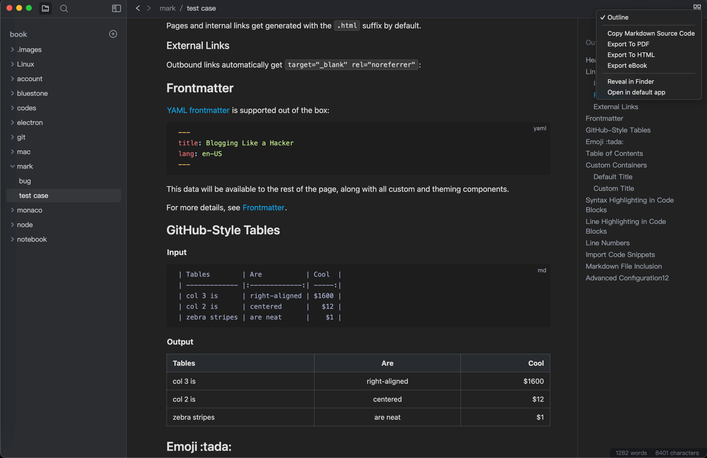
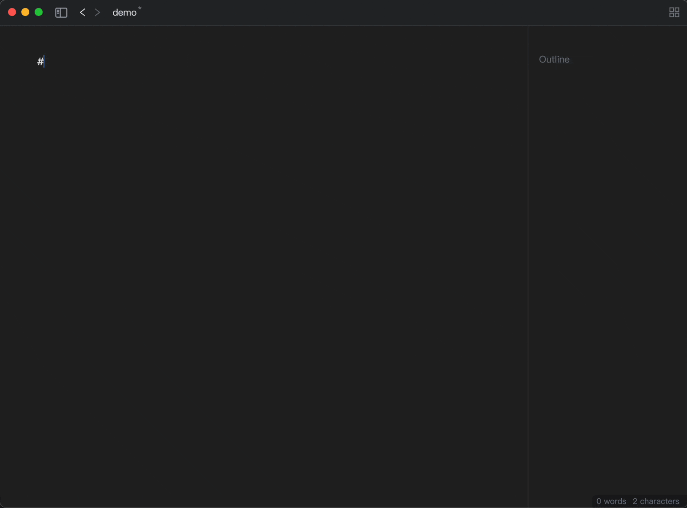
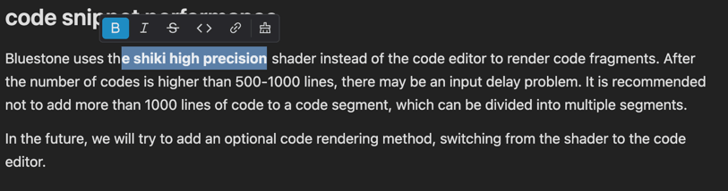
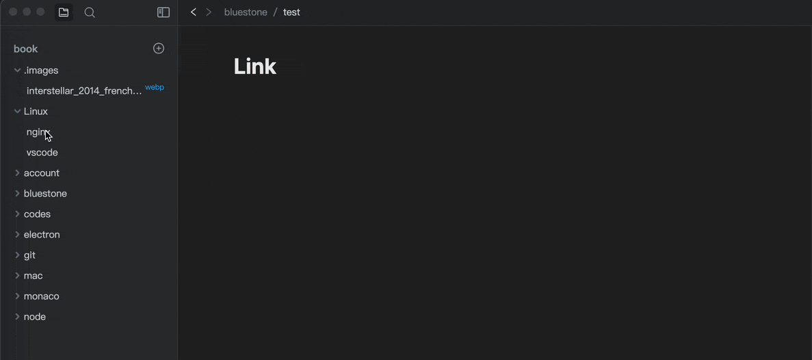
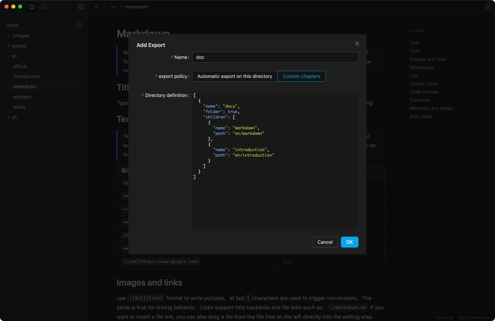
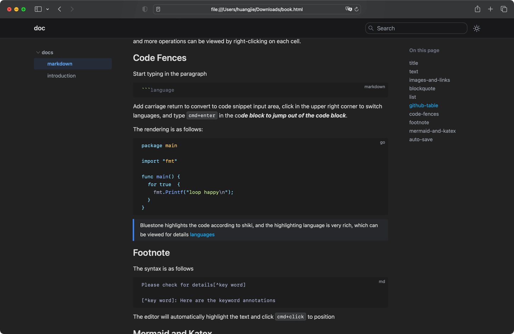
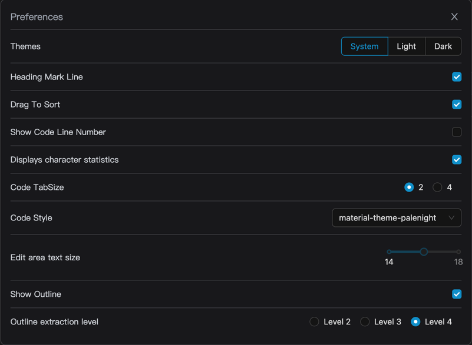

# Bluestone
A WYSIWYG markdown editor.
[Download (signed and notarized)](https://github.com/1943time/bluestone/releases/latest)
 | [中文文档](./ZH_README.md)

# Brief introduction

Bluestone is an WYSIWYG Markdown editor，Currently only `Mac` system is supported，
use [gfm](https://github.github.com/gfm/) syntax，expanded [Mermaid](https://mermaid.js.org/) graphics [Katex](https://katex.org/) formula，
Supports light and dark color schemes, with the goal of improving the Markdown reading and editing experience.

## Format

Text format can be converted with floating bar or syntax

## Link
Links and images support file paths, usually imported files can be dragged in from the file tree, or directly use ctrl + v

## Export

Support exporting pdf, html, and ebook.

An eBook is a document that combines multiple documents into one document by chapter and is equipped with a search function.

Select Export eBook, and Choose a custom chapter.

Will merge multiple documents in to a html, convert pictures to base64, and internal links will jump to each other.

The result is as follows

## Preferences

currently, the editor supports the following preferences

