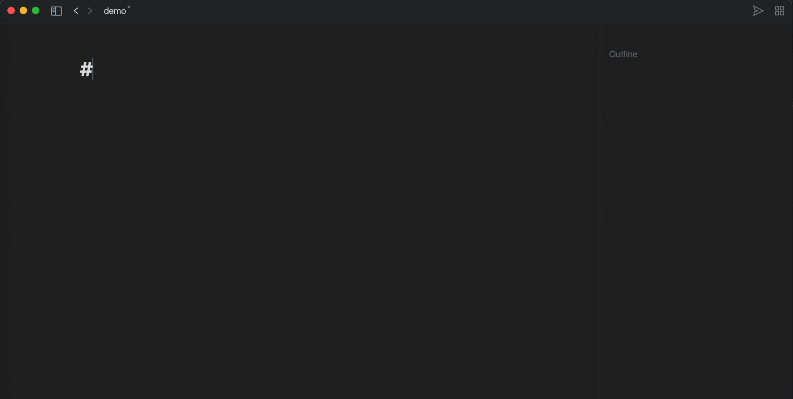
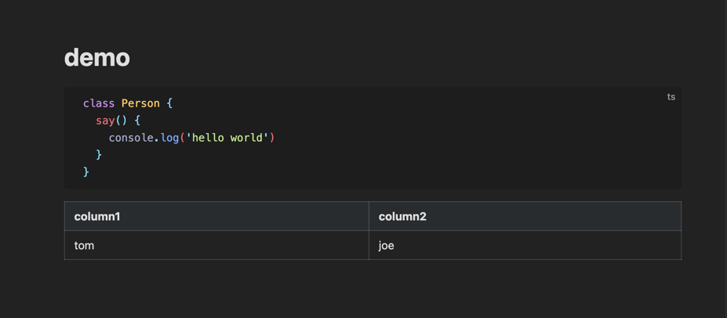
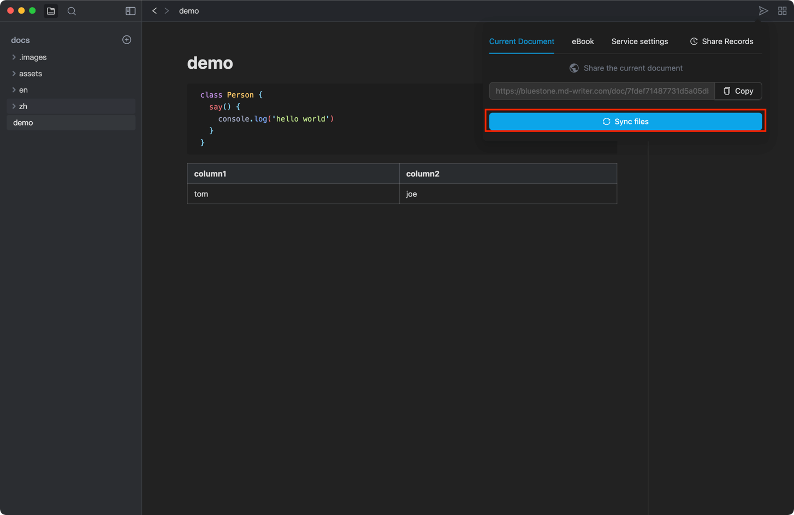
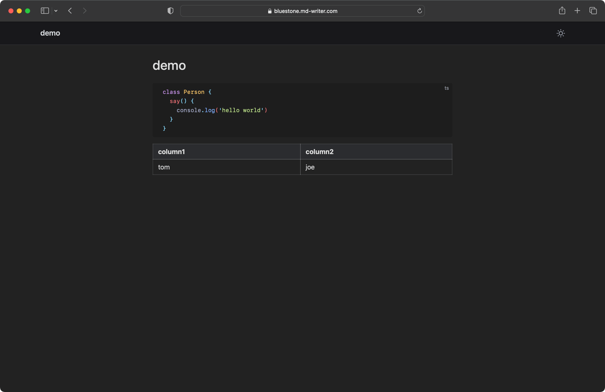

# Bluestone
A WYSIWYG markdown editor, Help you share bins your way.
[Document](https://bluestone.md-writer.com/book/docs) |
[Download](https://github.com/1943time/bluestone/releases/latest)
| [中文文档](https://bluestone.md-writer.com/book/zh-doc)

# Brief introduction

BlueStone is an open source WYSIWYG Markdown editor，Currently only `Mac` system is supported，
use [gfm](https://github.github.com/gfm/) syntax，expanded [Mermaid](https://mermaid.js.org/) graphics [Katex](https://katex.org/) formula，
Supports light and dark color schemes, with the goal of improving the Markdown reading and editing experience.
At the same time, it provides free document sharing capabilities, making documents easier to share and disseminate,
such as synchronizing markdown to your own Linux server or cloud storage.

> The above usage documents are generated by Bluestone editor

## share demo

Currently, markdown is supported to Linux servers and Alibaba Cloud OSS, which only requires very simple configuration.

When the service parameters are configured.

Open a markdown file and write the following content

Click Share Button

to view the content in the browser

