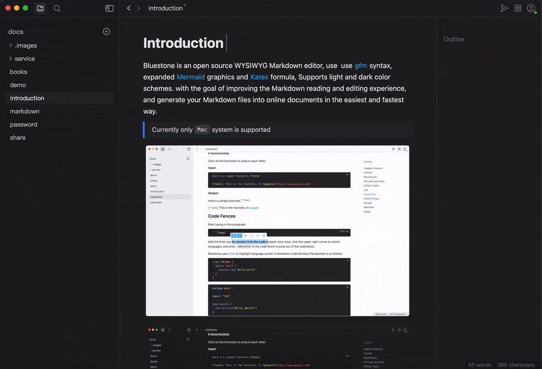

  
  
A WYSIWYG markdown editor. <a href="https://github.com/1943time/bluestone/releases/latest" target="_blank">Download</a> improving the Markdown reading and editing experience

# Brief introduction

Bluestone is an WYSIWYG Markdown editor，
use [GFM](https://github.github.com/gfm/) syntax，expanded [Mermaid](https://mermaid.js.org/) graphics [Katex](https://katex.org/) formula，
Supports light and dark color theme. and generate your Markdown files into online documents in the easiest and fastest way.
[documentation](https://pb.bluemd.me/official/book/docs/introduction)

## Drag
Freely drag to sort document elements

## Share
bluestone provides an optional sharing function that can automatically extract Markdown files and share them to the network, or merge multiple Markdown documents into a book at the same time [more](https://pb.bluemd.me/official/book/docs/share)

## Format

Text format can be converted with floating bar or syntax

## Link
Links and images support file paths, usually imported files can be dragged in from the file tree, or directly use ctrl + v

## Preferences

currently, the editor supports the following preferences

