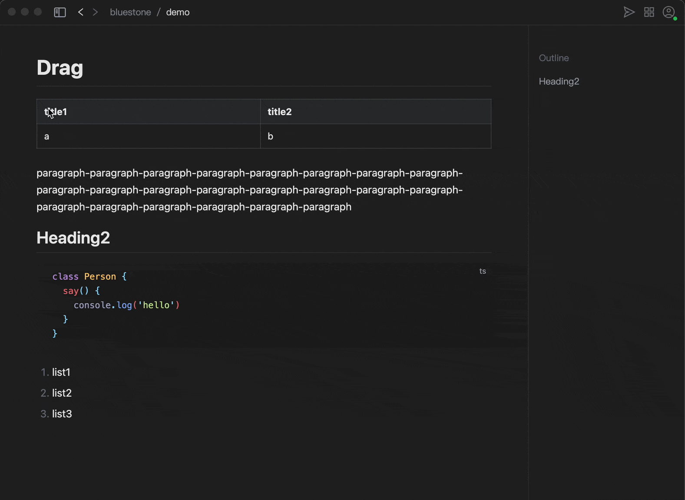

# Bluestone Markdown
A WYSIWYG markdown editor. improving the Markdown reading and editing experience [Download](https://github.com/1943time/bluestone/releases/latest) or

<a href="https://apps.apple.com/us/app/bluestone-markdown/id6451391474"><a>

***

# Introduction

Bluestone is an WYSIWYG Markdown editor，use [GFM](https://github.github.com/gfm/) syntax，expanded [Mermaid](https://mermaid.js.org/) graphics [Katex](https://katex.org/) formula，
Supports light and dark color theme. and generate your Markdown files into online documents in the easiest and fastest way.

Unlike source code mode, Bluestone is more like a rich text editor, and it uses Markdown as the host.
The reason for this is that bluestone wants to maintain the universality and cross-platform features of Markdown,
and add a rich text editing experience on this basis.

[documentation](https://pb.bluemd.me/official/book/docs/introduction)

## Features
- Use pure WYSIWYG editing mode, compatible with markdown syntax conversion, so markdown symbols will not be searched when using the search function.
- Automatically record and clear file history, view and roll back at any time.
- Using [shiki](https://github.com/shikijs/shiki) as code syntax highlighting, the syntax analysis is more fine-grained and beautiful.
- Enhanced table operation, allowing for free adjustment of the number and sorting of rows and columns. and line breaks can be made within table-cell.
- Multiple lines of content can be nested in list-item.
- Supports block-level and inline editing rendering of [katex](https://katex.org/).
- Support rendering [mermaid](https://mermaid.js.org/) graphics.
- The file path is automatically rebuilt, when the file or folder path changes, the related dependent links and image paths will automatically change.
- Support exporting html and pdf.
- Can drag document elements to change their order.
- Supports pasting of HTML, markdown code, and plain text, when pasting HTML, it will automatically download the images in the HTML and convert the path.
- Through simple configuration, it is easy to synchronize the markdown documents generated by the editor to your own server or cloud storage, making it easy to quickly share documents with others.

## Drag

## Format

Text format can be converted with floating bar or syntax

## Link
Links and images support file paths, usually imported files can be dragged in from the file tree, or directly use ctrl + v

