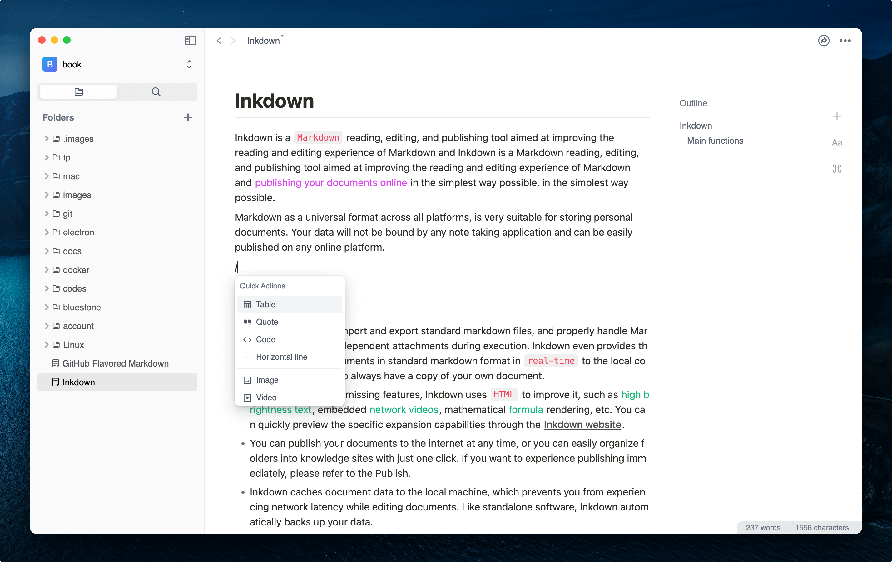
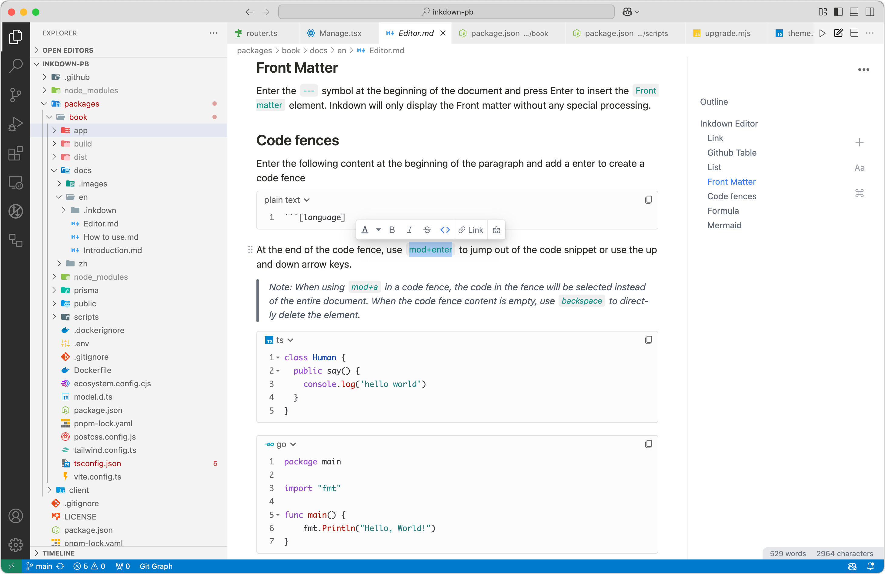
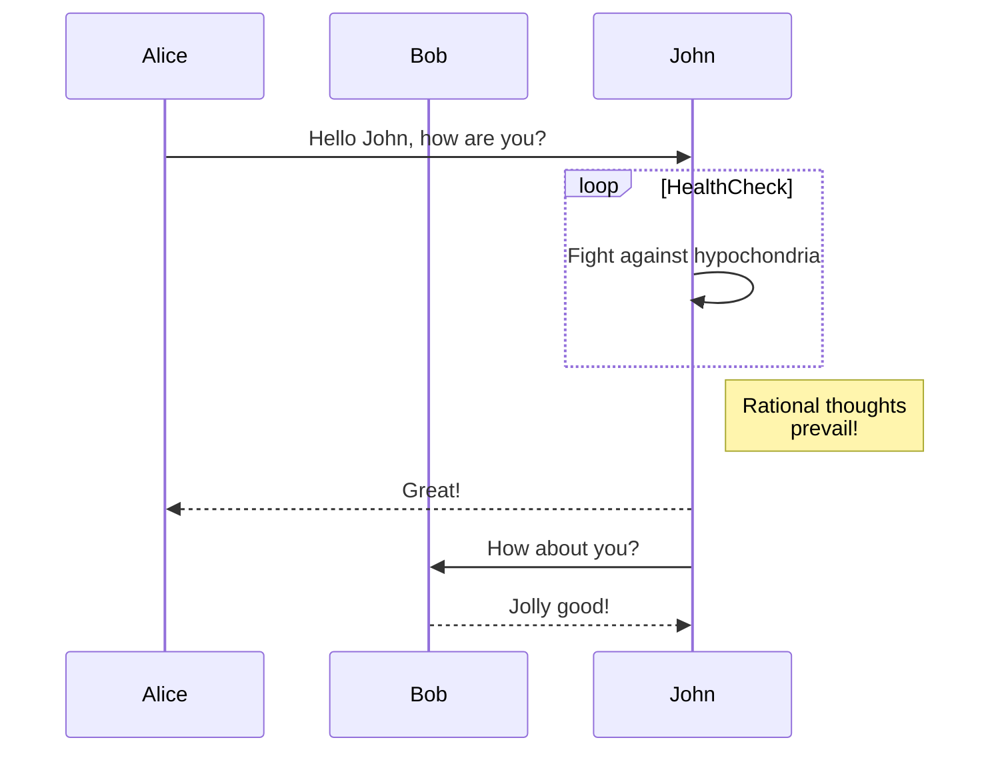

<h1>Inkdown</h1>


Improve markdown reading and editing experience, and facilitate network sharing.

| Mac                                                                                                                                                                                 | Windows                                                                                                                                                                                 | Linux                                                          | VsCode                                                                         |
| ----------------------------------------------------------------------------------------------------------------------------------------------------------------------------------- | --------------------------------------------------------------------------------------------------------------------------------------------------------------------------------------- | -------------------------------------------------------------- | ------------------------------------------------------------------------------ |
| [Arm64](https://github.com/1943time/inkdown/releases/latest/download/Inkdown-mac-arm64.dmg) [X64](https://github.com/1943time/inkdown/releases/latest/download/Inkdown-mac-x64.dmg) |   [Arm64](https://github.com/1943time/inkdown/releases/latest/download/Inkdown-win-arm64.exe)   [X64](https://github.com/1943time/inkdown/releases/latest/download/Inkdown-win-x64.exe) | [Release](https://github.com/1943time/inkdown/releases/latest) | [Market](https://marketplace.visualstudio.com/items?itemName=1943time.inkdown) |

# Introduction

Inkdown is a WYSIWYG Markdown editor that aims to improve the markdown reading and editing experience and add the ability to share freely.

This document assumes that you have a basic understanding of Markdown. The following is an introduction to common editing operations for Inkdown. You can use shortcut keys or enter `/` symbols at the beginning of a paragraph to insert elements. More shortcuts can be found in the menu on the right.




### Vs code




## Features

- The rich text editing mode is used, while also compatible with Markdown syntax conversion and editing habits. When using the search function, Markdown symbols will not be searched.
- Automatically record and clear file history, can be viewed and rolled back at any time.
- Provides a sharing program, Linux server required [doc](https://pb.inkdown.me/inkdown/book/docs/offline-version#deployment-publish-program).
- Enhanced table operations, allowing for easy adjustment of the order and quantity of rows and columns in the table, and the ability to wrap within the table.
- Support the editing and display of block and inline [Katex](https://katex.org/) formulas
- Supports [mermaid](https://mermaid.js.org/) graphic syntax.
- You can freely drag and adjust the order of document elements.
- Supports multi tab editing mode
- Support pasting HTML, plain text, and markdown code. When pasting HTML and markdown code, it can be configured to automatically download network images to the local machine and convert paths during pasting.

## Link

You can use the link options in the floating bar to add links to text, which can be other markdown files in the space or protocol addresses such as HTTP. As shown in the following image:

> Inkdown uses relative paths to save file links in the source markdown file.


You can also use `tab` to complete the file path and add a `#` to link to the anchor of the markdown file


Use `mod+click` to open the link. If it is a file path, you can also use `mod+alt+click` to open the link with a new tab page.

If there are other files that reference an open document, the referenced tag will be displayed in the navigation bar.


## Github Table

After creating the table, use `mod+enter` to create a new row, and use `mod+shif+backspace` to delete the current row.

> Right click in any table cell of the table to view more operations.
>
> Use `tab` to switch to the next table cell, `shift+tab` to return to the previous table cell

| Name | Area     | Balance |
| ---- | -------- | ------- |
| jack | New York | $1600   |
| joe  | London   | $128    |
| zoe  | Shanghai | $523    |

## List

Typing `1` or `-` with spaces at the beginning of a paragraph can convert it to an ordered or unordered list. Adding`[ ]`and spaces at the beginning of a paragraph can convert them into a task list, or use shortcut keys in the system menu to control them.

1. List item1
2. List item2
3. List item3

   1. Nested Item1
   2. Nested Item2

      ```ts
      const text = 'This is the nested content of list items'
      ```

   3. Nested Items3


- [x] Todo1
- [ ] Todo2

List items can be nested with content. Use `mod+enter` to insert new elements into the list items, and use `tab` or `shift+tab` to indent or undo the list.

## Code fences

Enter the following content at the beginning of the paragraph and add a enter to create a code fence

````
```[language]
````

Click on the language display area in the upper right corner of the code fence to switch between code snippet languages or copy code content. At the end of the code fence, use `mod+enter` to jump out of the code snippet or use the up and down arrow keys.

> Note: When using `mod+a` in a code fence, the code in the fence will be selected instead of the entire document.

```ts
class Human {
  public say() {
    console.log('hello world')
  }
}
```

```go
package main

import "fmt"

func main() {
    fmt.Println("Hello, World!")
}
```

```swift
import Cocoa
struct MarksStruct {
    var mark: Int
    init(mark: Int) {
      self.mark = mark
    }
}
var aStruct = MarksStruct(mark: 98)
print(aStruct.mark)
```

## Mermaid

Mermaid is a tool that uses syntax to render graphics. When you create a code fence for the Mermaid language, the Mermaid graphics will be automatically rendered below the code snippet for [more details](https://mermaid.js.org/).

When the cursor leaves the input area, the code fence will be automatically collapsed, and the rendering effect is as follows:



## Formula

Type`$$`at the beginning of the paragraph to create a block level formula editing area, where the formula will automatically render below. When the cursor leaves the editing area, it will be automatically folded. The rendering effect is as follows:

$$
\int_{-\infty}^{+\infty} e^{-x^2} dx = \sqrt{\pi}
$$

In line formula:$\int_{-\infty}^{+\infty} e^{-x^2} dx = \sqrt{\pi}$

## Deployment Publish Program

> The publishing program is temporarily suspended and is being revised.

Inkdown provides a`Node.js` based network service program, allowing your documents to be easily shared with other readers. He will establish a mapping between the device file path and remote documents, allowing local Markdown documents to be shared to the network with just one click, and will automatically manage image dependencies and link conversions. The usage process is very simple. If you have your own `Linux` server, you can install it in 5 minutes.

### Sharing program features

- No intrusion into local documents, only synchronize relevant files to the server when you want to share local documents.
- Using `sqlite` as data storage, Linux servers generally include the sqlite program by default.
- You can share a single markdown file or the entire folder. The document links in the folder will automatically convert the links when uploaded, and internal documents can use file paths to jump to each other.
- When synchronizing file updates, the `hash` value of the file will be compared, and uploaded documents or images will not be uploaded again.
- The images that the document depends on will be automatically managed. When the document is closed for sharing, the images will be automatically deleted and there will be no redundant files on the server.
- The generated document and editor display effects are completely consistent, using `next.js` as the server-side rendering framework. The network document opens very quickly, and the document is responsive. It can also be read normally on mobile devices.
- The `device ID` and `file path` generate a unique ID on the server, and multiple devices will not affect each other. A server can also be used by multiple people simultaneously.
- The service program has the ability to automatically update. If a new service program is released, an upgrade prompt will appear in the editor. Click the upgrade button to proceed. If the service is not updated, you can try executing `pm2 restart inkdown` in the project directory.

> When renaming or moving files and folders in the Inkdown Editor, if the custom service is enabled, the remote file mapping path will be automatically changed.

### Install

Network programs rely on the latest `nodejs` features and have certain requirements for `Linux` system versions.

- `centos` 8+
- `ubuntu` 20+
- `debian` 10+

Assuming you log in to the server using the `root` account

```sh
# Need unzip decompression program or yum install unzip
apt install unzip
# Install nodejs management tool
curl -fsSL https://fnm.vercel.app/install | bash
source $HOME/.bashrc
# Installing nodejs 20
fnm install 20
# Download and install the Inkdown sharing program
curl -fsSL https://github.com/1943time/bluestone-service/releases/latest/download/install.sh | bash
cd bluestone-service
# Starting network services
pm2 start
```

### Docker

```sh
cd bluestone-server
docker build -t inkdown-image .
docker run -d --name inkdown -p 3006:80 inkdown-image
```

We will expose the Inkdown port to the `3006` port of the host, and you can change it as needed.

### Settings

There is a `package.json` file in the bluestone service folder. By default, the sharing program uses port `80`. If you want to change the port, you can change the `scripts ->start` field in the JSON file

```json
{
  "scripts": {
    //"start": "next start -p 80",
    // Change port to 3000
    "start": "next start -p 3000"
  }
}
```

In the inkdown field, there are the following configurations that can be customized according to usage

```json
{
  "inkdown": {
    "secret": "BLUESTONE",
    "home-site": "",
    "favicon": "/favicon.png"
  }
}
```

- `secret`Connection key, used in editor connection settings, recommended to be changed.
- `home-site`Configure this field to display the site icon in the upper right corner of the network document, click the link to the homepage.
- `favicon`The icon path of the site is located in the `/public` folder of the service program by default, and can be replaced with other images.

After completing the settings, you can publish the Markdown document with just one click. The local image that the Markdown document depends on will be automatically uploaded when published.

### Nginx

In most cases, the sharing program may not enable port `80`, and you may need an nginx proxy. The following nginx configurations can be used as a reference:

```nginx
server {
    listen      80;
    # listen      443 ssl;
    # ssl_certificate path.pem;
    # ssl_certificate_key path.key;
    # ssl_session_timeout 5m;
    # ssl_ciphers ECDHE-RSA-AES128-GCM-SHA256:ECDHE:ECDH:AES:HIGH:!NULL:!aNULL:!MD5:!ADH:!RC4;
    # ssl_protocols TLSv1 TLSv1.1 TLSv1.2;
    # ssl_prefer_server_ciphers on;
    server_name  doc.yourdomain.com;
    gzip on;
    gzip_comp_level 6;
    gzip_min_length 1k;
    gzip_static on;
    gzip_types
    application/javascript
    text/javascript
    text/css
    application/json
    application/manifest+json
    image/svg+xml
    application/wasm;
    client_max_body_size 100M;
    location / {
        proxy_set_header X-Real-IP $remote_addr;
        proxy_set_header X-Forwarded-For $proxy_add_x_forwarded_for;
        proxy_set_header Host  $http_host;
        proxy_set_header X-Nginx-Proxy true;
        proxy_http_version 1.1;
        proxy_pass    http://localhost:3006; # port
        if ($request_filename ~* ^.*?\.(gif|jpg|jpeg|png|css|js|json|ttf|woff|woff2|wasm)$){
           expires  max;
        }
    }
}
```
