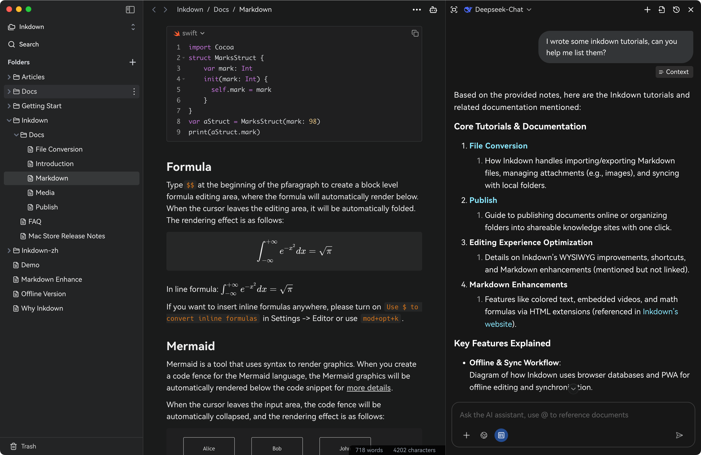
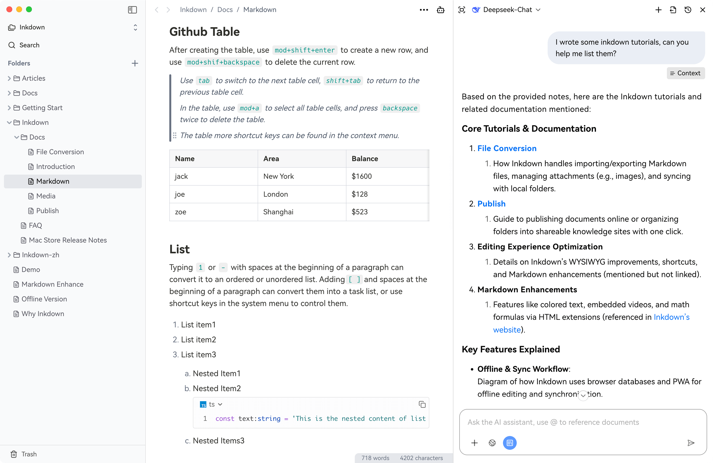
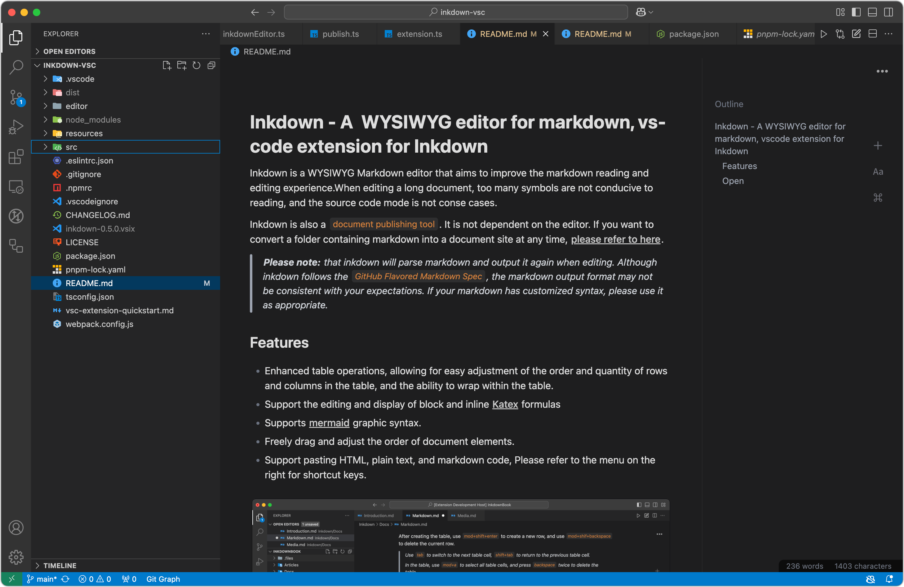

<h1>Inkdown</h1>

Inkdown Editor is a WYSIWYG editor and an LLM dialogue tool, fully compatible with GitHub Flavored Markdown Spec.

[Documentation](https://www.inkdown.cn/docs)

| Mac                                                                                                     | Windows                                                                                                   | VsCode                                                                         |
| ------------------------------------------------------------------------------------------------------- | --------------------------------------------------------------------------------------------------------- | ------------------------------------------------------------------------------ |
| [Arm64](https://www.inkdown.cn/download/darwin/arm64) [X64](https://www.inkdown.cn/download/darwin/x64) |   [Arm64](https://www.inkdown.cn/download/win32/arm64)   [X64](https://www.inkdown.cn/download/win32/x64) | [Market](https://marketplace.visualstudio.com/items?itemName=1943time.inkdown) |

### Vs code

