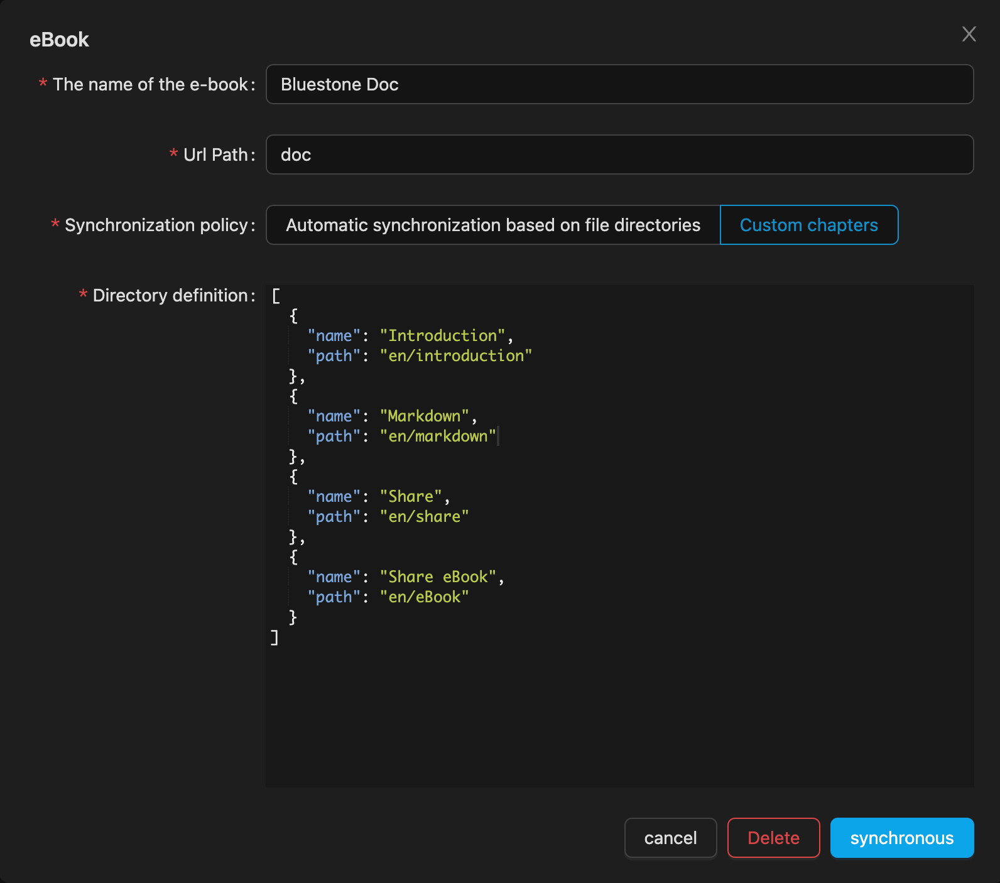

# eBook

Each eBook depends on a folder, and eBooks will start generating based on the contents of the folder.

E-book is a collection of documents with chapter classification of multiple Markdown documents in a folder, and the available file paths between documents, such as: `./markdown.md`, will automatically convert the path when synchronizing with the cloud, and add a full-text search function. E-books are divided into two generation modes, automatic generation and custom chapter generation.

> This document is the eBook generated by Bluestone

## Automatically generated

Automatic generation is based on the directory structure and markdown file, automatically generate relevant chapters, if you have no requirements for chapter sorting and naming, automatic generation configuration will be simpler.

Configuration items

- eBook name
- Access path (mainly used for URL paths)
- Filter folders (can be ignored during automatic synchronization)

## Custom chapters

To manually generate a scenario that requires the naming and sorting of chapters, you need to manually fill in a JSON file, and customize the chapter format as follows:

```json
{
	"name": "Introduce",
	"folder": true, // folder
	"children": [
		{
			"name": "about",
       // The file path is relative to the path to the open folder for example: start/about is not /Users/**/opendir/start/about
			"path": "filePath"
		}
	],
	"name": "start",
	"folder": true, // 文件夹
	"children": [
		{
			"name": "Fundation",
			"path": "start/fundation"
		},
		{
			"name": "Advanced",
			"path": "start/advanced"
		}
	]
}
```

Click Sync will automatically generate the corresponding chapter based on the above data structure

as follows

