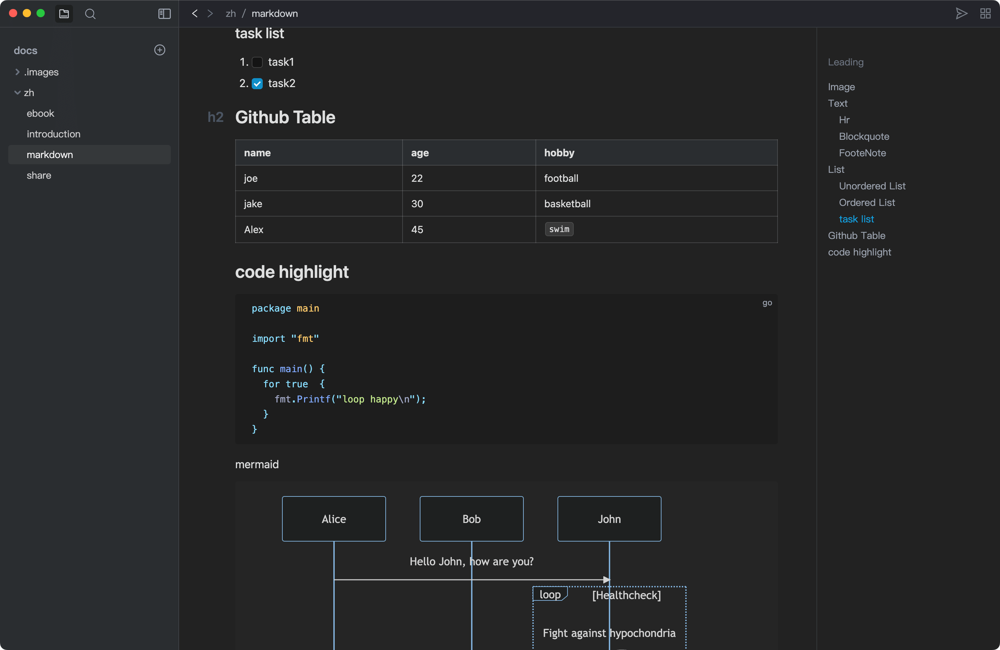
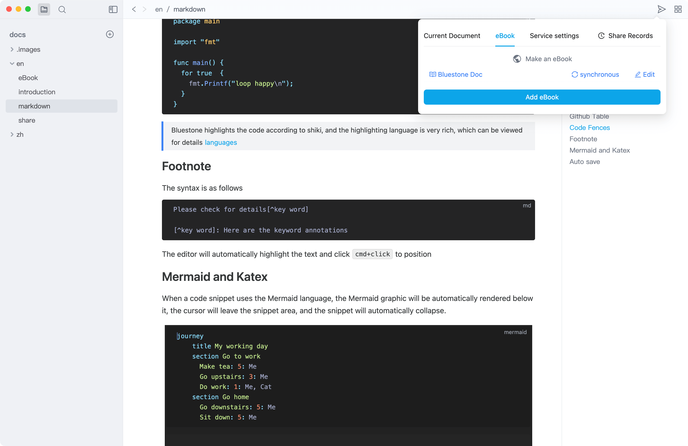

# Brief introduction

BlueStone is an open source WYSIWYG Markdown editor，Currently only `Mac-Arm 64` system is supported，use[gfm](https://github.github.com/gfm/) syntax，expanded [Mermaid](https://mermaid.js.org/) graphics [Katex](https://katex.org/) formula，Supports light and dark color schemes, with the goal of improving the Markdown reading and editing experience. At the same time, it provides free document sharing capabilities, making documents easier to share and disseminate, such as synchronizing markdown to your own Linux server or cloud storage.

> This document was generated by the Bluestone editor

## Navigation

- [BlueStone Markdown Writer Guide](markdown.md)
- [Share settings](share.md)
- [eBook](eBook.md)
- [problem](problem.md)