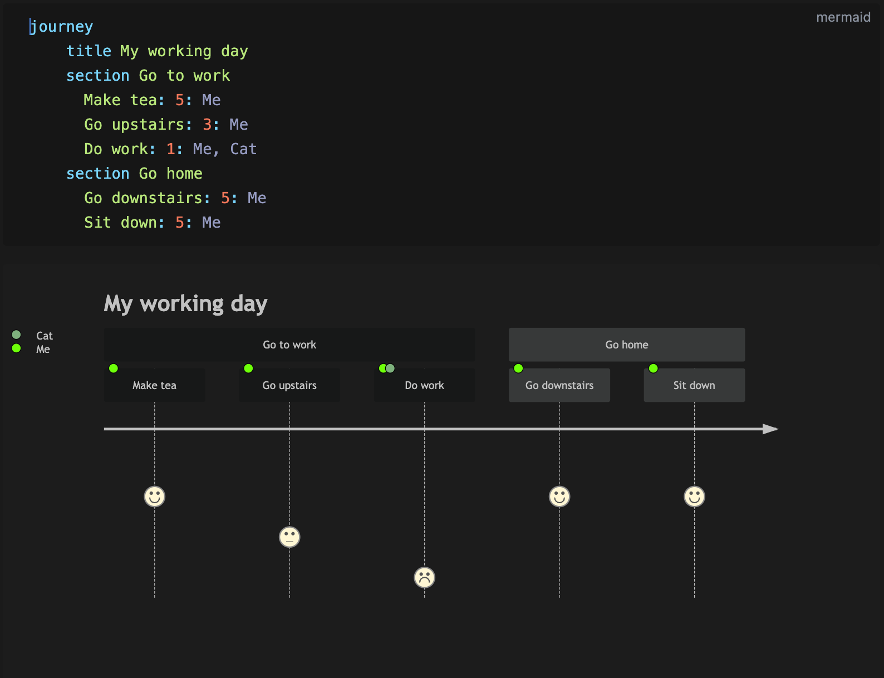
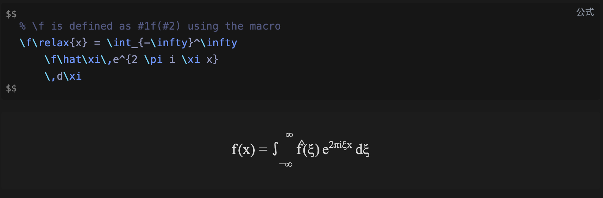

# Markdown

> BlueStone uses GitHub Flavored Markdown syntax, assuming you already know Markdown syntax. Document formatting can be inserted by syntax or shortcut keys, if you prefer to use syntax to convert formatting, please refer to this document, shortcut keys in the system menu bar - paragraph or format。

## Title

Typing 1-5 `#`signs plus spaces at the beginning of a paragraph can be converted to a level 1-5 heading

## Text

> Text formatting is triggered by the last character such as: `bold` When typing the last `*` will be converted to bold, if you want to add text to the compound format, it is recommended to use floating column control, such as: bold, italic at the same time. Cursor needs to be unformatted and you can use the arrow left and right keys.

| 语法                                  | 效果                                |
| ------------------------------------- | ----------------------------------- |
| `*Italic*`                            | *Italic*                            |
| `**Bold**`                            | **Bold**                            |
| `~~Strikethrough~~`                   | ~~Strikethrough~~                   |
| `***Italic bold***`                   | ***Italic bold***                   |
| `InlineCode`                          | `InlineCode`                        |
| `***~~Italic bold strikethrough~~***` | ~~***Italic bold strikethrough***~~ |
| `[Link](https://www.google.com)`      | [Link](https://www.google.com)      |

## Images and links

use `![alt][link]` format to write pictures，at last`]`characters are used to trigger conversions，The same is true for linking behavior，Links support http backlinks and file links such as：`./markdown.md` If you want to insert a file link, you can also drag a file from the file tree on the left directly into the editing area.

Screenshots can be copied directly into the editing area, and if the folder is not opened, the picture will be automatically saved to the system scratch area, and in the case of opening the folder, the picture will be saved in the root directory '.images' folder

## Blockquote

Use '>' plus spaces to convert block references as follows:

> Text contents

## List

Use `1` or `-` with a space to convert to an ordered or unordered list, enter `[ ]` and a space at the beginning of a list item to convert the list to a task list, or you can use shortcut keys to manipulate it.

Type `cmd+enter` into a list item to insert multiple paragraphs into the list item For example:

1. list item1
2. list item2

   Nested paragraph 1

   Nested paragraph 2

3. list item3

## Github Table

Enter the format `|title1|title2|` at the beginning of the paragraph to automatically create a table with 2 columns。

and use `cmd+enter` to create the next line, Use `cmd+shift+backspace` to delete the current row, and more operations can be viewed by right-clicking on each cell.

## Code Fences

Start typing in the paragraph

```markdown
```language
```

Add carriage return to convert to code snippet input area, click in the upper right corner to switch languages, and type `cmd+enter` in the code block to jump out of the code block.

The rendering is as follows:

```go
package main

import "fmt"

func main() {
  for true  {
    fmt.Printf("loop happy\n");
  }
}
```

> Bluestone highlights the code according to shiki, and the highlighting language is very rich, which can be viewed for details [languages](https://github.com/shikijs/shiki/blob/main/docs/languages.md)

## Footnote

The syntax is as follows

```md
Please check for details[^key word]

[^key word]: Here are the keyword annotations
```

The editor will automatically highlight the text and click `cmd+click` to position

## Mermaid and Katex

When a code snippet uses the Mermaid language, the Mermaid graphic will be automatically rendered below it, the cursor will leave the snippet area, and the snippet will automatically collapse.



Type `$$` at the beginning of the paragraph to add a carriage enter, the Katex formula editing area will be created, the Katex formula will be automatically rendered below it, the cursor leaves the snippet area, and the snippet is automatically collapsed. An example figure is as follows:



## Auto save

The document will be automatically saved after 3 seconds of change, and it will be automatically saved when the application is closed, in between, you can also type `cmd+s` to save manually.

After the document is changed, the `*` sign appears after the file name on the navigation bar, the `*` sign disappears and it is saved.