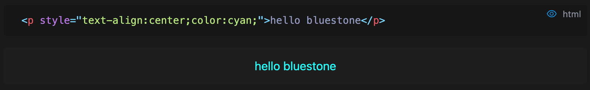

# Common problem

## html rendering

Bluestone uses a pure rich text editing mode, which does not support writing rendering HTML code directly, and can use code snippets to render, such as:



Click the eye icon to render the HTML directly, and the result is as follows:

```html render
<p style="text-align:center;color:cyan;">hello bluestone</p>
```

Export as:

```html
```html render
<p style="text-align:center;color:cyan;">hello bluestone</p>
```

## code snippet performance

Bluestone uses the shiki high precision shader instead of the code editor to render code fragments. After the number of codes is higher than 500-1000 lines, there may be an input delay problem. It is recommended not to add more than 1000 lines of code to a code segment, which can be divided into multiple segments.

In the future, we will try to add an optional code rendering method, switching from the shader to the code editor.