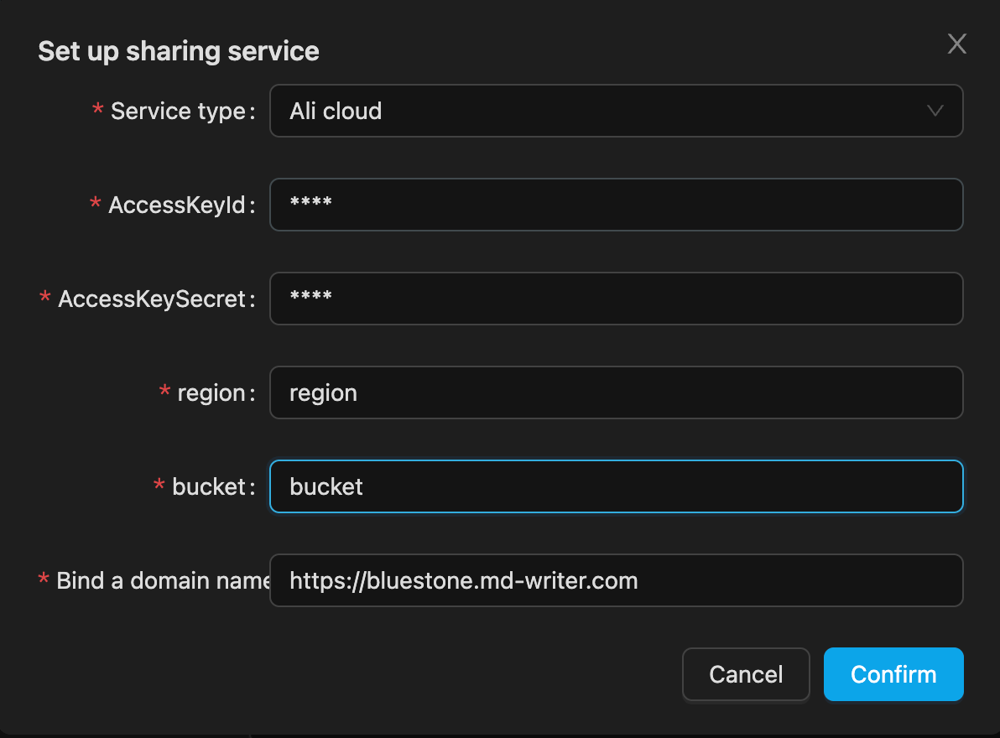
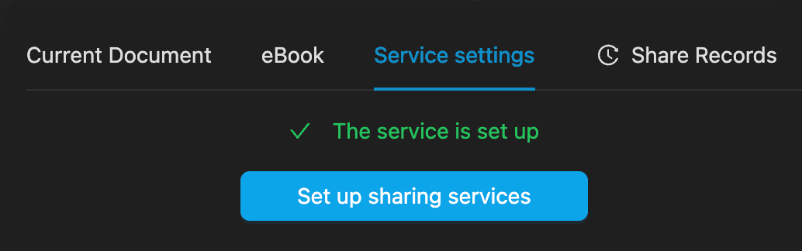

# Share

Convenient document sharing is one of the important goals of Bluestone, for users who are accustomed to local reading and writing, markdown as the form of documents to provide an editing network browsing function, users can freely choose their own sharing services, currently provide Linux server and Alibaba Cloud OSS storage mode

When sharing, the imported pictures and local connections will be automatically converted, the relevant files will be synchronized to the remote for remote viewing, and the `hash` value of the file will be automatically verified during each synchronization, and the uploaded or unchanged files will not be uploaded repeatedly.

> Online documents have been added responsive adaptation, after sharing can be sent to mobile, PC, pad and other devices, Bluestone currently uses client-side rendering, because of the serverless operating environment, and the generation of static HTML is not conducive to network cache optimization.

## Share the principle

1. Upload the built web program to the service storage location you define.
2. Each time you share, the image and link that the document depends on will be converted, and the image will be automatically uploaded to the location specified by your service。
3. Convert documents into JSON files and store them in the service.
4. All files are indexed to their native paths, and when the files are renamed or moved, a new document is uploaded at the next synchronization.
5. After uploading, it will be recorded locally, and the sharing record can be deleted, and the remote file will be deleted.
6. Open the website link and pull the corresponding JSON file for rendering

## Service Settings

Before you can share documents, you need to set your service type and parameters

### Linux server

> There are many cloud service providers that support IP access to the server, if you don't want to buy a domain name, you can use IP to access the server and share documents. Bluestone used `ssh` to upload the required documents.

1. Install the nginx proxy service on the server
2. The configuration file 'doc.conf' added specifically for document services reads as follows:

   ```nginx
   server {
     server_name 000.000.000.100; # Your domain name or IP
     location / {
       root /opt/doc;  # Specifies the static website root
       index index.html;
       try_files $uri $uri/ /index.html;
     }
     listen 80;
   }
   ```

3. Configure service-related parameters in Bluestone, remember the root directory of nginx, and store the directory in the configuration as follows:

   

4. Click OK, it will try to upload the initialization file, and after success, you can select any markdown file to share

### Alibaba Cloud

> [Alibaba Cloud](https://www.alibabacloud.com/en)OSS needs to bind your own domain name to open HTML for browsing, and Chinese mainland regional domain names need to be recorded, or you can consider Hong Kong. The advantages of cloud storage are fast access and very cheap prices in personal use scenarios.

The required parameters are as follows:

- `accessKeyId`
- `accessKeySecret`
- `region`
- `bucket`
- `domain` domain name for your visit

Steps to configure Alibaba Cloud backend buckets

1. Create a bucket for the document
2. In bucket configuration -> domain name management, bind the purchased domain name
3. In Data Management -> Static Page, set the default homepage to `index.html` the default 404 page to `index.html` Error document response code `200`
4. Populate the required parameters in the bluestone service settings



Click Save to automatically verify whether you can connect, and the dependent file will be uploaded after the link, which may take tens of seconds. After saving successfully, select any markdown document and click the current document to share it immediately.