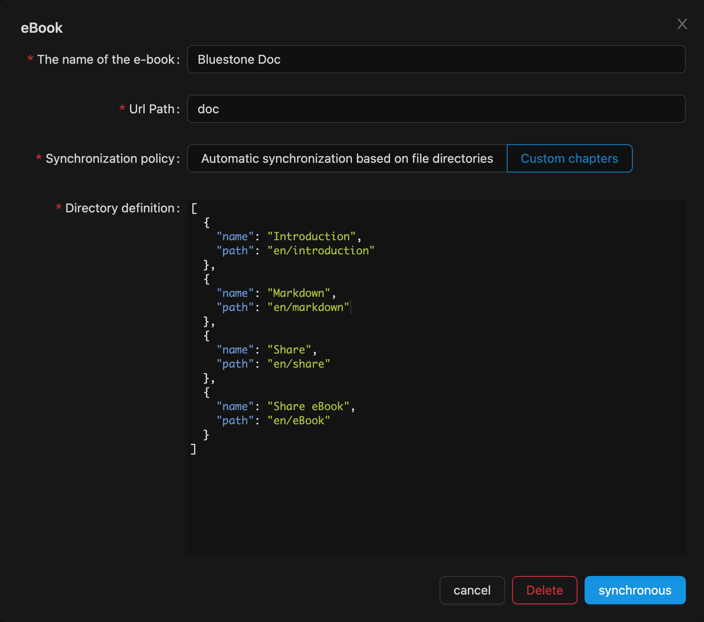

# 电子书

每本电子书都依赖于一个文件夹，将根据文件夹开始生成电子书。

电子书是一种将文件夹内的多个Markdown文档组成含有章节分类的文档集合，文档之间可用文件路径，例如：`./markdown.md`，同步云端时会自动转换路径，并加入了全文搜索功能。电子书分为2种生成模式，自动生成与自定义章节生成。

> 本篇文档即是青石生成的电子书

## 自动生成

自动生成是根据目录结构与markdown文件，自动生成相关章节，如果您对章节排序与命名没有要求，自动生成配置会更加简单。

配置项

- 电子书名称
- 访问路径 （主要用于url路径）
- 过滤文件夹 （在自动同步时可忽略该文件夹）

## 自定义章节

手动生成用于对章节命名及排序有要求的场景，需要手动填写json文件，自定义章节格式如下：

```json
{
  "name": "介绍",
  "folder": true, // 文件夹
  "children": [
    {
      "name": "about",
      // 文件路径是相对于打开文件夹的路径 例如：start/about 而不是 /Users/**/opendir/start/about
      "path": "filePath"
    }
  ],
  "name": "start",
  "folder": true, // 文件夹
  "children": [
    {
      "name": "Fundation",
      "path": "start/fundation"
    },
    {
      "name": "Advanced",
      "path": "start/advanced"
    }
  ]
}
```

点击同步会根据以上数据结构自动生成对应章节

如下：

